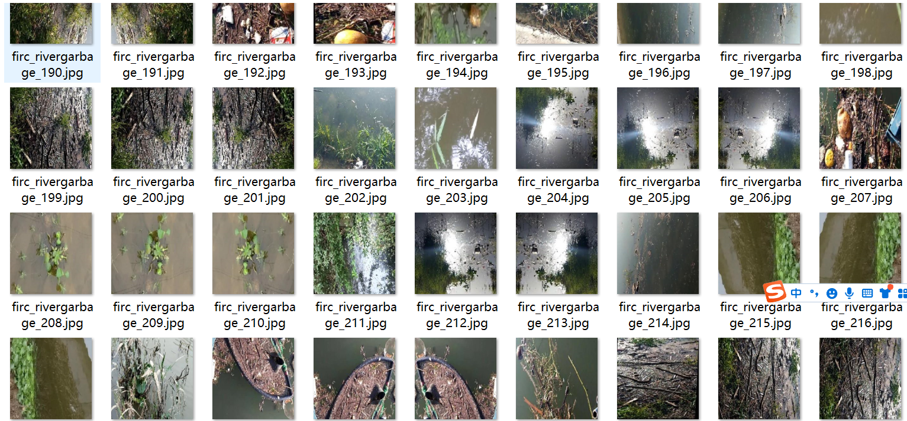
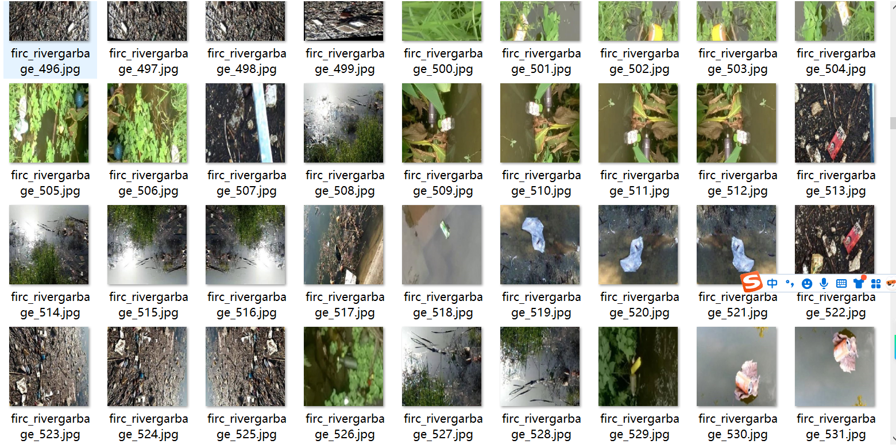
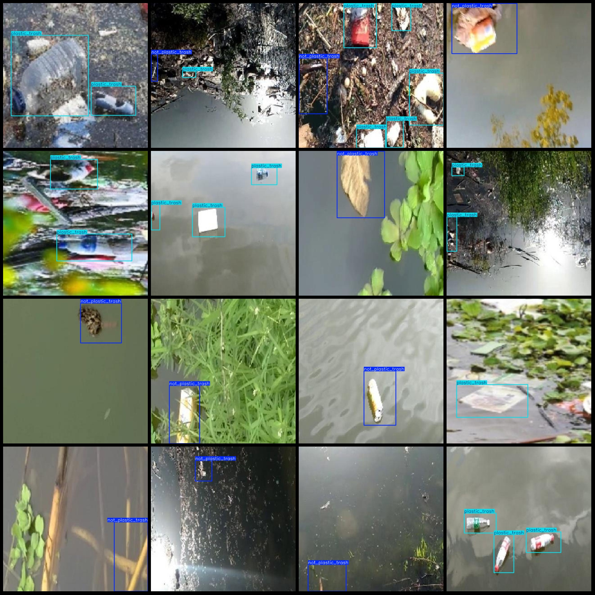

# River Drainage Trash Detection Data Set in Pascal VOC+YOLO Format with 1974 Images and 2 Categories

Please note that some of the datasets have been enhanced mainly through rotation.
The dataset format: Pascal VOC format + YOLO format (txt file without split path, only containing jpg images along with corresponding VOC format xml files and YOLO format txt files)
Number of images (jpg file count): 1974
Number of annotations (xml file count): 1974
Number of annotations (txt file count): 1974
Number of categories: 2
Annotation category names (Note that the order of categories in the YOLO format does not match this, but is based on the labels folder's classes.txt): ["not_plastic_trash", "plastic_trash"]
Each category has the following number of bounding boxes:
- not_plastic_trash (non-plastic trash) = 1284
- plastic_trash (plastic trash) = 1933
Total bounding box count: 3217
Image resolution: 640x640
Labeling tool used: labelImg
Labeling rules: draw a bounding box around the category
Important Notice: No specific instructions are provided at this time.
Special Note: This dataset does not guarantee the accuracy of the trained models or weight files.
Image Preview:
Annotation Example:

## Images

Here is a pay link on Stripe ( https://buy.stripe.com/3cs8yP7sY87d0vu9AB ). Please contact me lonlonago@foxmail.com after funding $89, and I will send you a complete data files , thank you!

